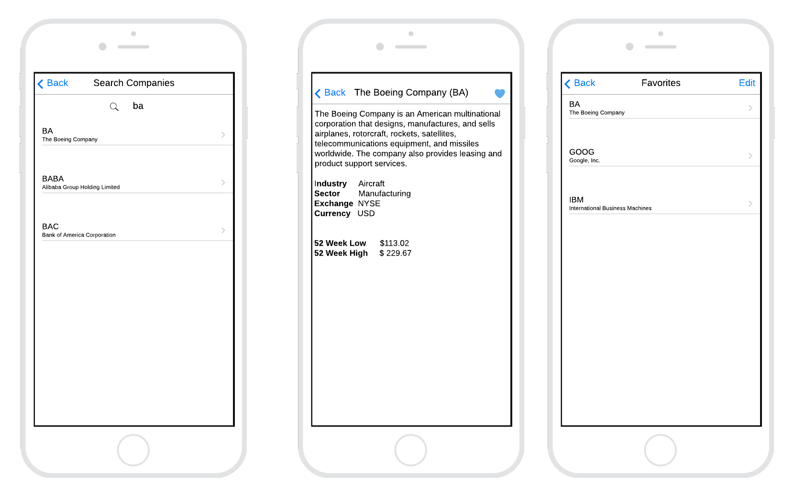

# Tickets

The following tickets reflect the core elements of this project.

## STOCK-1000: Abstract AlphaVantage to API (Backend)

The current app skeleton makes direct use of the Alpha Vantage API. Instead of calling the API directly, we want to wrap it into our backend API (found in the `api` package). This will make it easier for us to enrich the API with other data, such as company logos, later on.

### Acceptance Criteria

1. A new resource is available in the `api` package that wraps the Alpha Vantage API.
2. Replace the existing call to Alpha Vantage in the `stockley` package with a call to the new API endpoint.
3. The app still behaves in the same way it did prior to the integration.
   <!-- getting stuck on specific type error message, and ran out of time to resolve on my own-->
   <!-- if I was allowed to code pair with another teammate or I would push up a wip branch and ask for input, def something I overlooked -->

## STOCK-1001: Build Search Detail Page

To help customers learn more about the various companies, we've decided to invest in a feature that enables consumers to search for publicly traded companies and retrieve details about these companies. This requires modification to the original search page written by our intern, Greg.

We don't have a Pixel perfect app design; however, the wireframes below shows the information we'd like the app to provide. Please use your own discretion to implement the design. We want the information to be simple, yet meaningful, so please limit the provided information to the information presented in the mockup.

Note: You'll need to extend the backend to support the new endpoint. See [https://www.alphavantage.co/query?function=OVERVIEW&symbol=IBM&apikey=demo](https://www.alphavantage.co/query?function=OVERVIEW&symbol=IBM&apikey=demo) for an example of how the data is returned by Alpha Vantage.

### Acceptance Criteria

1. Users are able to search for complete or partial ticker symbols.
<!-- X -->
2. The app should return a list of potential matches based on the search string.
<!-- X -->
3. Users should be able to view the details of each company in a user-friendly format.
<!--X -->
4. The search screen should show the same results and search string when the user navigates back from the detail screen.
<!--X-->

## STOCK-1002: Implement History Feature

Our customers have asked us for the ability to see their search history for a given session. Due to the immutable nature of the history, we've elected to use a more robust state management library to manage this information. Using Redux (or similar state management library), implement a simple search history feature that displays a user's company search history in the order they were searched along with some manner of timestamp.

Note that while we have a strong preference for Redux, you are free to use any state management library you are comfortable with (e.g., React Context API, Zustand, MobX).

### Acceptance Criteria

1. Users should be able to view their search history for a given session with a simple, scrollable listing of ticker symbols and some timestamp indicating when the user searched for the item.
2. There is no need to persist search history between states.
<!-- X -->

## STOCK-1003: Visualize Stock Prices

<!-- did not complete -->

Our customers have expressed an interest in seeing the monthly performance of a stock in a visual format.
Specifically, they've asked for a 6 month view of the close of trading day value of a specific stock.

 <!-- close of trading day v alue of a specific stock -->

See [https://www.alphavantage.co/query?function=TIME_SERIES_MONTHLY&symbol=IBM&apikey=demo](https://www.alphavantage.co/query?function=TIME_SERIES_MONTHLY&symbol=IBM&apikey=demo) for an example of how the data is formatted from the Alpha Vantage API. Note that customers are only interested in the `close` attribute.

The example snippet uses React Native Chart Kit; however, you're free to use any other charting library you're more comfortable with.

### Acceptance Criteria

1. Users are able to search for a specific ticker symbol and view the 6-month close of day trading value for a given company in a graph format.

## STOCK-1004 (Optional): A La Carte

If time permits, please implemement an experimental feature of your own choosing OR make incremental improvements to the overall code base. We love when engineers exercise the [Campsite Rule](https://wolfgang-ziegler.com/blog/Development-Practice-The-Campsite-Rule.aspx) and leave the codebase in better shape than they found it.

Examples of optional features may include (but certainly aren't limited to) items such as:

<!-- Changed the syntax of components to be functional. Did this for consistency in reading of code. A quick win.  -->

1. A more sophisticated graph showing additional information that you'd consider to be useful for someone learning about stocks.
2. An enhancement to an existing feature, such as the ability to rank companies by importance.
3. A more personalized experience, such as the ability to add and remove companies from favorites.
